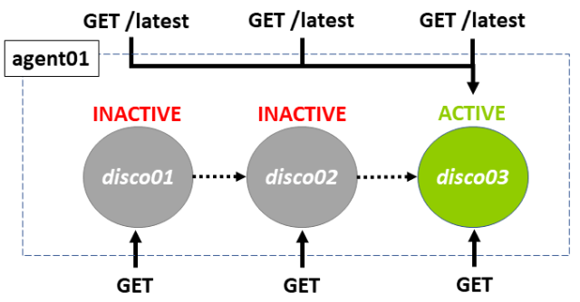
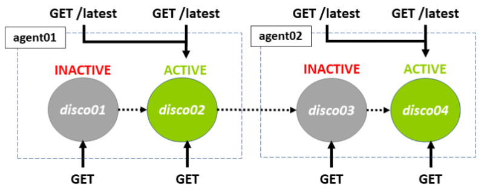
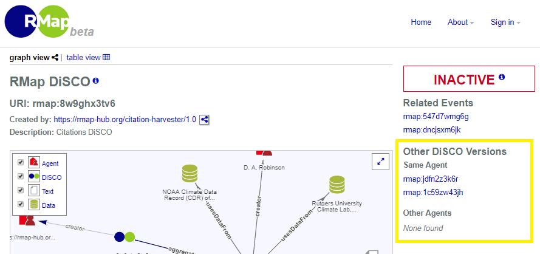

# DiSCO Versioning in RMap

The purpose of this document is to describe the versioning behavior of RMap DiSCOs and to demonstrate how to navigate DiSCO versions through the RMap API. 

* [Versioning Types](#versioning-types)
    * [1. Update DiSCO Using Same Agent](#1-update-disco-using-same-agent)
    * [2. Derive DiSCO Using Different Agent](#2-derive-disco-using-different-agent)
* [Versions Through the API](#versions-through-the-api)
* [Versions Through the GUI](#versions-through-the-gui)
* [Example 1 - Single Agent](#example-1---single-agent)
    * [Version 1 of the DiSCO](#version-1-of-the-disco)
    * [Version 2 of the DiSCO](#version-2-of-the-disco)
    * [Version 3 of the DiSCO](#version-3-of-the-disco)
* [Example 2 - Different Agents](#example-2---different-agents)
    * [The Derivative DiSCO](#the-derivative-disco)
    * [Changes to the `/allversions` path](#changes-to-the-allversions-path)

## Versioning Types
A DiSCO is a named graph describing an aggregation of related scholarly resources at a moment in time. The graph is identified by a unique URI that can be used to retrieve that exact graph later. While DiSCOs are immutable, it is possible to create a version chain of DiSCOs.  There are two kinds of versioning behavior that we will cover in detail here:

### 1. Update DiSCO Using Same Agent
If a system user (or "Agent") creates a DiSCO and then creates a new version of that DiSCO, the previous version is considered to be "inactive" and the new DiSCO becomes the "active" one. This is considered to be a DiSCO "update". The diagram below is a representation of this. 



All previous versions remain accessible in their original form even though they are "inactive". There can only be one active version of the DiSCO at a time in the same lineage where all DiSCOs were created by the same Agent. A sequence of DiSCOs created by a single Agent can be thought of conceptually as a "lineage".

### 2. Derive DiSCO Using Different Agent
If a system Agent creates a new version of a DiSCO based on one that was created by a different Agent, though the mechanism for doing this is identical to the process for the same Agent, this time the original DiSCO remains "active" and the new DiSCO is linked to the original in the Event. This new DiSCO is considered to be "derived" from the original, but unlike in the first version behavior, it does not inactive the DiSCO it is derived from. It has created a new lineage. As with a standard DiSCO update, all previous versions persist in the exact form they were created and can be retrieved in full through the API.  The version relationships are recorded through the Events associated with them. The diagram below explains the behavior and demonstrates how you can have 2 related lineages with 2 active DiSCOs stemming from the same source:



## Versions Through the API

The API provides several ways to navigate the DiSCO versions:
* The `GET /discos/{uri}` exposes [Memento](http://www.mementoweb.org/guide/quick-intro/) links. This expression of versions focuses on those created by a single Agent (a single "lineage"). You will not see versions created by others on these paths. Specifically the headers include links for:
  * A `/timegate` path to which you can use an `Accept-Datetime` to retrieve the closest matching version of a DiSCO before that date-time, or the earliest if the date-time is before the initial creation date.
  * A `/timemap` which displays links to all versions of a DiSCO and the times created using the media type `application/link-format` 
  * The DiSCO's preceding, superseding, and latest versions, where relevant 
* Using the `GET /discos/{uri}/agentversions` and `GET /discos/{uri}/allversions` paths to retrieve a list of related DiSCOs. This is the means by which you can retrieve DiSCO versions created by other Agents.

## Versions Through the GUI
The user interface displays links to the various versions of a DiSCO on the DiSCO summary page. Here is an example with the versions highlighted. note also that the status information is displayed on this page:



## Example 1 - Single Agent
Below is a description of what happens when a single Agent creates a series of DiSCO versions.

### Version 1 of the DiSCO
Say your initial graph represents an aggregation of an article and some software. You might create the first DiSCO representing these two objects like this:
```
POST https://test.rmap-hub.org/api/discos
Content-Type: text/turtle

# body
@prefix dc: <http://purl.org/dc/terms/> .
@prefix cito: <http://purl.org/spar/cito/> .
@prefix ore: <http://www.openarchives.org/ore/terms/> .

<> a <http://purl.org/ontology/rmap#DiSCO> ;
  <ore:aggregates> <https://doi.org/10.0000/article01> ;
  <ore:aggregates> <https://doi.org/10.0000/software01> .
<https://doi.org/10.0000/article01>
  a <http://purl.org/spar/fabio/JournalArticle> .
  <cito:cites> <https://doi.org/10.0000/software01> .
<https://doi.org/10.0000/software01>
  a <http://purl.org/dc/dcmitype/Software> ;
```
_Note that RMap  IDs and other types of IDs are generally opaque, but for these examples I have given them names that make them easier to track_

If successful, the response from the server will be something like this:
```
HTTP/1.1 201 Created
Location: http://rmap-hub.org/api/discos/rmap%3Adisco01
Link: <http://rmap-hub.org/api/events/rmap%3Aevent01>;
           rel="http://www.w3.org/ns/prov#wasGeneratedBy"
 
# body
ark:/00000/disco01
```
Let's take a look at the Event that is referenced in the response header:
```
@prefix rmap: <http://purl.org/ontology/rmap#> .
@prefix prov: <http://www.w3.org/ns/prov#> .
@prefix dc: <http://purl.org/dc/terms/> .
 
<rmap:event01>
    a <http://purl.org/ontology/rmap#Event> ;
    rmap:eventTargetType <http://purl.org/ontology/rmap#DiSCO> ;
    rmap:eventType <http://purl.org/ontology/rmap#created> ;
    prov:wasAssociatedWith <rmap:agent01> ;
    
    prov:startedAtTime "2010-03-28T11:11:11Z" ;
    prov:endedAtTime "2019-03-28T11:11:12Z" ;
    dc:description "A new DiSCO was created" ;
    prov:generated <rmap:disco01> ;
    rmap:lineageProgenitor <rmap:disco01> .
```
The Event captures when the DiSCO was created, what was created, and who created it. In addition to this, it references the `rmap:lineageProgenitor`. This is the first DiSCO in the lineage of the DiSCO generated and is used to tie together DiSCO versions.

If you retrieve the DiSCO using the path in the `Location` header provided on the Create response like this:
```
GET http://rmap-hub.org/api/discos/rmap%3Adisco01
```
You will see that useful version information is available in the response header:  
```
HTTP/1.1 200 OK
Location: https://rmap-hub.org/api/discos/rmap%3Adisco01
Link: <http://purl.org/ontology/rmap#active>;rel="http://purl.org/ontology/rmap#hasStatus"
Link: <https://test.rmap-hub.org/api/discos/rmap%3Adisco01>;rel="latest-version memento";datetime="Thu, 28 Mar 2019 11:11:11 GMT"
Link: <https://test.rmap-hub.org/api/discos/rmap%3Adisco01/events>;rel="http://www.w3.org/ns/prov#has_provenance"
Link: <https://test.rmap-hub.org/api/discos/rmap%3Adisco01/latest>;rel="original timegate"
Link: <https://test.rmap-hub.org/api/discos/rmap%3Adisco01/timemap>;rel="timemap"
Memento-Datetime: Thu, 28 Mar 2019 11:11:11 GMT
Content-Type: application/vnd.rmap-project.disco+rdf+xml; version=1.0
```
The RMap DiSCO is behaving as a [Memento](http://www.mementoweb.org/guide/quick-intro/) - a snapshot of a web resource in time. Per the Memento specification, the header cites a  `timegate`, `latest-version`, and `timegate` headers available. Notice also that the status is being cited as `rmap:active`. 

What if you now add a new version of the DiSCO?

 ### Version 2 of the DiSCO 
Say that you have generated some data for the project and would like to add a dataset to your original aggregation.  You would like the new aggregation to supersede the previous DiSCO. To do this you would POST your new DiSCO to the path of the previous DiSCO:
 ```
POST https://rmap-hub.org/api/discos/rmap%3Adisco01
Content-Type: text/turtle

# body
@prefix dc: <http://purl.org/dc/terms/> .
@prefix cito: <http://purl.org/spar/cito/> .
@prefix ore: <http://www.openarchives.org/ore/terms/> .

<> a <http://purl.org/ontology/rmap#DiSCO> ;
  <ore:aggregates> <https://doi.org/10.0000/article01> ;
  <ore:aggregates> <https://doi.org/10.0000/software01> ;
  <ore:aggregates> <https://doi.org/10.0000/dataset01>  .
<https://doi.org/10.0000/article01>
  a <http://purl.org/spar/fabio/JournalArticle> .
  <cito:cites> <https://doi.org/10.0000/software01> .
  <cito:cites> <https://doi.org/10.0000/dataset01> .
<https://doi.org/10.0000/software01>
  a <http://purl.org/dc/dcmitype/Software> ;
<https://doi.org/10.0000/dataset01>
  a <http://purl.org/dc/dcmitype/Dataset> ;
```
 The 201 Created response looks identical to the one for the first DiSCO, but this time the Event is different:
 ```
@prefix prov: <http://www.w3.org/ns/prov#> .
@prefix dc: <http://purl.org/dc/terms/> .
 
<rmap:event02>
  a <http://purl.org/ontology/rmap#Event> ;
  rmap:eventTargetType <http://purl.org/ontology/rmap#DiSCO> ;
  rmap:eventType <http://purl.org/ontology/rmap#Update> ;
  prov:wasAssociatedWith <rmap:agent01> ;
  prov:startedAtTime "2019-04-29T12:00:11Z" ;
  prov:endedAtTime "2019-04-29T12:00:12" ;
  dc:description "An updated version of a DiSCO was created" ;
 
  rmap:inactivatedObject <rmap:disco01> ;
  rmap:derivedObject <rmap:disco02> ;
  prov:generated <rmap:disco02> ;
  rmap:lineageProgenitor <rmap:disco01>.
 ```
 ### Version 3 of the DiSCO
At this point, you can imagine that if you create a third DiSCO by POSTing a new version to the path of the second version, the Event would be very similar, but with the following properties:
```
<rmap:event03>
  a <http://purl.org/ontology/rmap#Event> ;
  ... 
  rmap:inactivatedObject <rmap:disco02> ;
  rmap:derivedObject <rmap:disco03> ;
  prov:generated <rmap:disco03> ;
  rmap:lineageProgenitor <rmap:disco01> .
```
The `rmap:lineageProgenitor` always points to the first DiSCO in the sequence - though it would be possible to walk between versions by following the `inactivatedObject`/`derivedObject` links, this provides a convenient shortcut for tying together related Events and, in turn, DiSCOs. 

If you GET the second version of the DiSCO having created the third, the headers have evolved accordingly. You can see that the status is now `inactive` because it is superseded and there are links to the predecessor and successor versions:
```
HTTP/1.1 200 OK
Location: https://rmap-hub.org/api/discos/rmap%3Adisco03
Link: <http://purl.org/ontology/rmap#inactive>;rel="http://purl.org/ontology/rmap#hasStatus"
<https://test.rmap-hub.org/api/discos/rmap%3Ajdfn2z3k6r>;rel="predecessor-version memento";datetime="Thu, 28 Mar 2019 11:11:11 GMT"
<https://test.rmap-hub.org/api/discos/rmap%3Ajdfn2z3k6r>;rel="successor-version memento";datetime="Tue, 28 May 2019 11:11:11 GMT"
Link: <https://test.rmap-hub.org/api/discos/rmap%3Adisco03>;rel="latest-version memento";datetime="Tue, 28 May 2019 11:11:11 GMT"
Link: <https://test.rmap-hub.org/api/discos/rmap%3Adisco01/events>;rel="http://www.w3.org/ns/prov#has_provenance"
Link: <https://test.rmap-hub.org/api/discos/rmap%3Adisco01/latest>;rel="original timegate"
Link: <https://test.rmap-hub.org/api/discos/rmap%3Adisco01/timemap>;rel="timemap"
Memento-Datetime: Mon, 29 Apr 2019 12:00:11 GMT
Content-Type: application/vnd.rmap-project.disco+rdf+xml; version=1.0
```
In addition to the Memento headers, you can also use the `/discos/{uri}/agentversions` path to retrieve a list of DiSCO versions. If you add "agentversions" to any DiSCO path in the lineage, like this:
```
GET https://rmap-hub.org/api/discos/rmap%3Adisco02/versions
Accept: text/plain
```
You will receive a list of all DiSCO versions:
```
Location: https://rmap-hub.org/api/discos/rmap%3Adisco02
Content-Type: text/plain

# body
rmap:disco01
rmap:disco02
rmap:disco03
```
At this point, if you access the `/discos/{uri}/allversions` path, it will look identical since no other Agents have created a version of the DiSCO.

## Example 2 - Different Agents
This example builds on the previous one.  Assuming those 3 DiSCOs still exist, a second system Agent might wish to make their own assertion about what should be included in the DiSCO. For example, the second Agent might know that the software is now located at a new address. They can assert their own version by POSTing to the location of the existing DiSCO. 

### The Derivative DiSCO 
To create a derived DiSCO as another Agent, the Request might look like this:
 ```
POST https://rmap-hub.org/api/discos/rmap%3Adisco03
Content-Type: text/turtle

# body
@prefix dc: <http://purl.org/dc/terms/> .
@prefix cito: <http://purl.org/spar/cito/> .
@prefix ore: <http://www.openarchives.org/ore/terms/> .
@prefix dct: <http://purl.org/dc/terms/> .

<> a <http://purl.org/ontology/rmap#DiSCO> ;
  <dct:description> "Posting this updated DiSCO to indicate the updated software link" ;
  <ore:aggregates> <https://doi.org/10.0000/article01> ;
  <ore:aggregates> <https://doi.org/10.0000/software01-new-location> ;
  <ore:aggregates> <https://doi.org/10.0000/dataset01>  .
<https://doi.org/10.0000/article01>
  a <http://purl.org/spar/fabio/JournalArticle> .
  <cito:cites> <https://doi.org/10.0000/software01-new-location> .
  <cito:cites> <https://doi.org/10.0000/dataset01> .
<https://doi.org/10.0000/software01-new-location>
  a <http://purl.org/dc/dcmitype/Software> ;
<https://doi.org/10.0000/dataset01>
  a <http://purl.org/dc/dcmitype/Dataset> ;
```
Note that the author of this DiSCO added a `dct:description` property to explain the purpose of the derivative.  The Event that is cited in the header will read as follows:
```
@prefix dcterms: <http://purl.org/dc/terms/> .
@prefix prov: <http://www.w3.org/ns/prov#> .
@prefix rdf: <http://www.w3.org/1999/02/22-rdf-syntax-ns#> .
@prefix rdfs: <http://www.w3.org/2000/01/rdf-schema#> .
@prefix rmap: <http://purl.org/ontology/rmap#> .
@prefix xml: <http://www.w3.org/XML/1998/namespace> .
@prefix xsd: <http://www.w3.org/2001/XMLSchema#> .
 
<rmap:event04> a <rmap:Event> ;
    rmap:eventTargetType <http://purl.org/ontology/rmap#DiSCO> ;
    rmap:eventType <http://purl.org/ontology/rmap#Derivation> ;
    dcterms:description "A DiSCO was derived" ;
    prov:wasAssociatedWith <rmap:agent02> ;
    prov:endedAtTime "2019-06-07T12:00:12" ;
    prov:startedAtTime "2019-06-07T12:00:01Z" ;
   
    rmap:sourceObject <rmap:disco03> ;
    rmap:derivedObject <rmap:disco04> ;
    prov:generatedObject <rmap:disco04> ;
    rmap:lineageProgenitor <rmap:disco04> .
```
From this Event, you can see that this DiSCO has been linked to the other Agent's DiSCO, but it has started a new lineage - the `lineageProgenitor` points to this new DiSCO. If you were to retrieve this DiSCO via `GET /discos/{uri}` the headers would look very similar to those of `rmap:disco01`.  The versions from the original lineage would not appear in the `timemap` or any of the other Memento headers.  You could only discover the derivative relationship by looking at the Event. 

### Changes to the `/allversions` path
Now that the original lineage has derivative DiSCOs with multiple Agents, there will be a change to the `/discos/{uri}/allversions` path for the source DiSCO.  If you retrieve `allversions` for any of the DiSCOs in the lineage of the original source DiSCO, you will see the new derived DiSCO added to the list: 
```
Accept:text/plain
GET https://rmap-hub.org/api/discos/rmap:disco01/allversions
```
The result:
```
Content-Type: text/plain

# body
rmap:disco01
rmap:disco02
rmap:disco03
rmap:disco04
```
If the second Agent continues to create new versions, these will also appear in the first Agent's list.

If you do the same lookup on the new DiSCO, however, this relationship is one way:
```
Accept:text/plain
GET https://rmap-hub.org/api/discos/rmap:disco04/allversions
```
Results in:
```
Content-Type: text/plain

# body
rmap:disco04
```
The behavior of this becomes a little complex if a third Agent derives a DiSCO from the second Agent's DiSCO. In that instance, the third Agent's DiSCO appears in the `allversions` list of the second Agent's, but it does not appear in the original Agent's list. So, while the `allversions` path will follow the lineage of a derived DiSCO, it will not leap to the DiSCO lineage of a third Agent!

