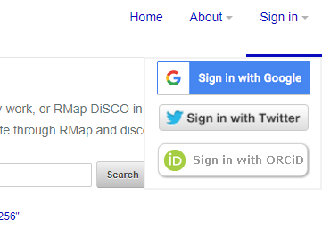
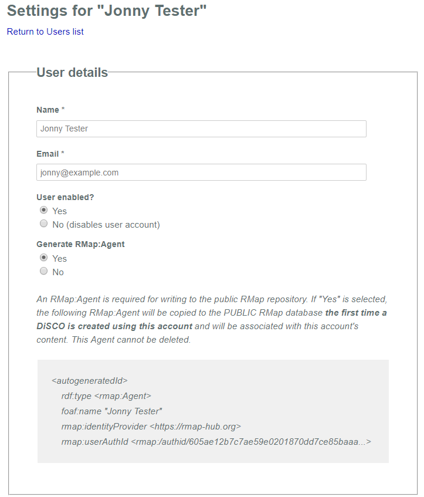
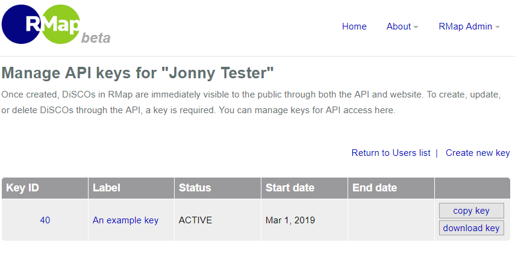
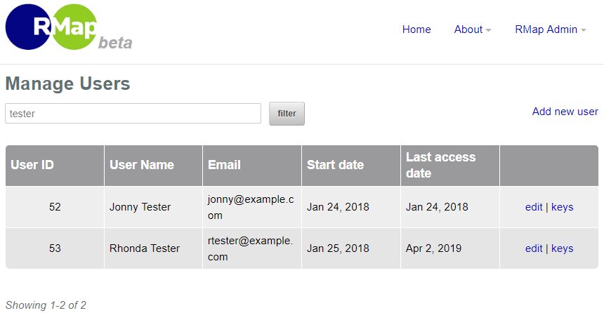

# User Management in RMap
The purpose of this document is to take a deep dive into the way users are expressed and managed in RMap.
* [Representations of Users in RMap Databases](#representations-of-users-in-rmap-databases)
  * [The RMap Agent](#the-rmap-agent)
  * [The Web Interface User](#the-web-interface-user)
* [Managing Web Users and RMap Agents](#managing-web-users-and-rmap-agents)
  * [Creating RMap Web Users](#creating-rmap-web-users)
    * [Logging in Using Google, Twitter, or ORCID](#logging-in-using-google-twitter-or-orcid)
    * [The Admin Tool](#the-admin-tool)
  * [Creating RMap Agents](#creating-rmap-agents)
* [Verifying an Agent Is Who They Say They Are](#verifying-an-agent-is-who-they-say-they-are) 
* [The DiSCO's `dcterms:creator`](#the-discos-dctermscreator) 


## Representations of Users in RMap Databases

RMap "Users" are represented in two ways:
1. In the RMap triplestore as _RMap Agents_
2. In a relational database to support web user interface use. 

This corresponds to two layers of the current RMap implementation:
1. At the heart of RMap is the core service component. Written in Java, this interacts directly with a triplestore to manage the RMap objects as named graphs and is independent of the web interfaces or authorization components. Put a different way it is possible to write Java code against the RMap core component without needing a key or password to access the component. 
2. The RMap web interfaces are used to present the RMap triplestore content via the web (visually and through a REST API). They depend on the core RMap component to handle interactions with the triplestore. They are also used to manage and control who can write to the triplestore via the RMap core service since the the core component does not concern itself with authorization.   

You can see these layers expressed in the [software block diagram](../installation/software-stack.md). The triplestore _is_ the research map, the layers over it merely manage and constrain their presentation and interactions. 

To write to RMap, a user must have a representation in both layers of the system - an RMap Agent to represent them in the triplestore, and a User record to identify them in the web interfaces. 

### The RMap Agent
As discussed, at the heart of RMap is a triplestore. This holds:
* the immutable DiSCO graphs
* Agent graphs representing the creators of DiSCOs
* Events that capture information about actions that change the DiSCOs and Agents. 

Every change to a DiSCO or Agent is captured by an Event. The Event is linked in the triplestore to the Agent that triggered it. An Agent can create itself or can be created by another Agent.

Therefore, if a user is to modify data within the RMap triplestore they must be represented as an RMap Agent in order for them to be associated with changes they make in the triplestore. The Agent representation always has exactly 4 properties and looks something like this:
```
@prefix rdf: <http://www.w3.org/1999/02/22-rdf-syntax-ns#> .
@prefix rmap: <http://purl.org/ontology/rmap#> .
@prefix foaf: <http://xmlns.com/foaf/0.1/> .
 
<ark:/00000/rm227adfssj>
 a rmap:Agent ;
 foaf:name “Jane Smith”
 rmap:identityProvider <https://www.google.com> ;
 rmap:userAuthId <rmap:/authid/kajdf3942ja5jsdkflj2ask> .
```
The intention is to capture the bare minimum needed for provenance and to provide information about how the Agent gained access to the system. Additional assertions describing an Agent could potentially be provided as a DiSCO with the `rmap:Agent` URI as the DiSCO's `ore:aggregates` property. Later in the document there is an [explaination of the `rmap:userAuthId`](#verifying-an-agent-is-who-they-say-they-are) and how it can be use to verify the identity of an Agent.

The use of the term "Agent" is significant. An Agent does not necessarily represent the individual who signed up for a key, it simply represents an individual, organization, or a computer system that creates DiSCOs in RMap. 

If you wish to read more about the specific properties of an Agent and how they are represented as a graph, the API documentation contains a full description of the [Agent media type](.../api/agents/agent-media-type.md).

### The Web Interface User
The data in the RMap triplestore can be managed and read through the visual web GUI and the REST API, which interact with the core RMap component. While read-access to the triplestore data via each of these interfaces is not restricted, write-access is restricted to authorized users. The web GUI has tools to create and manage User accounts and API keys. The information for these accounts is stored in a relational database that is controlled by the RMap "auth" component. Both the API and GUI consult this auth component to confirm whether a user has access to write to the RMap triplestore.

## Managing Web Users and RMap Agents
So how does the web user and RMap Agent get created? This section will explain.

### Creating RMap Web Users
Assuming you are managing RMap via the standard interfaces, and not using the core component directly, there are two ways to create an RMap User. Any implementation of RMap can have one or both paths enabled:
1. A user can log in using Google, Twitter, or ORCID account (OAuth2)
2. An administrator can log in using the RMap admin tool and create a User profile on behalf of someone.

#### Logging in Using Google, Twitter, or ORCID
Users can initiate a User account by logging in to the RMap GUI using a Google, Twitter, or ORCID account. 



Each time they login in, they will be shown the provider's login screen, and it will redirect them them to the RMap account management tool. The first time the user logs in, their name, email address, and the some information about how they logged in is collected and stored in the relational database against their User record. 

From the welcome screen, users can view their profile and approve the creation of their RMap Agent representation in the triplestore (this is required for data creation). 



Users can also generate one or more keys that can be used to write DiSCOs to RMap using the REST API.  



On the server side, OAuth options can be configured in the [`rmap.properties`](../installation/software-stack.md#catalinaproperties) file. Each provider can be enabled or disabled. Only those that are enabled will appear in the list of login options. If all are disabled the login menu will not be displayed.

#### The Admin Tool
The admin tool for RMap is available through the GUI at `https://{rmap-gui-url}/admin/login`. The tool allows you to view all current users, create and update user profiles, and set up API keys on behalf of those users. This can be useful for implementations where Users will be verified manually before being provided API keys, or where there is a need for accounts that are not connected to a Twitter, Google, or ORCID account.



On the server side, the admin tool is enabled or disabled in the [`rmap.properties`](../installation/software-stack.md#catalinaproperties) file. There are also properties to configure the admin account user name and password.

The first time someone logs in to the admin tool, an Agent representation of the administrator is initiated. An example of this Agent can be [seen on the RMap production site](https://rmap-hub.org/api/agents/https://rmap-hub.org#Administrator). The administrator can hard-delete DiSCOs through the admin tool, and so it needs an Agent representation in order for Events to associate deletions with the Adminstrator. 

### Creating RMap Agents
When using the RMap API, an RMap Agent representation is created in the triplestore the first time a user attempts to change the RMap data. The sequence is as follows:

1. The user posts a new DiSCO via the API using a key/secret combination to identify themselves
2. The API component consults the auth component (which interacts with the relational database) to see if the key/secret is valid, and if it is retrieves the User record associated with the key.
3. If the User record references the RMap Agent's URI, that means an Agent graph has already been created
    *  Before creating the new DiSCO, the API component checks to see if the Agent name has changed since it was last used. If it has, the Agent graph will be updated and the change will be logged in an Event. 
    * The API component will send the new DiSCO information along with the Agent URI to the core component to perform an update on the triplestore.  The Agent URI will be linked to the Event for that action. 
4. If the User record does not yet reference the Agent URI and the User has approved the creation of their Agent, that means the User has not yet made any changes to the RMap triplestore. The API component inspects how the User was created to determine the next step:
    *  If the User was created via an OAuth login, an RMap Agent will be created citing the OAuth provider as the `rmap:identityProvider`. The Event associated with the creation of the Agent will show that the Agent created itself. 
    * If the User was created via the admin tool, an RMap Agent will be created [citing the Agent that represents the Administrator as the `rmap:identityProvider`](https://rmap-hub.org/api/agents/ark:/87281/t29c6vfm). The Event associated with the creation of the Agent will show that the Agent created itself.
5. If a new Agent was created, the URI for that Agent is saved on the User record in the relational database so that it can easily be looked up by the API component for the next change.

## Verifying an Agent Is Who They Say They Are

Depending on the implementation of RMap, you may have varying levels of confidence in the Agents that are creating DiSCOs. If users are creating themselves via OAuth, trust in the DiSCO data may be based on who that Agent is or appears to be. The Agent model has been implemented in a specific way through the web interfaces in order to provide an option to verify whether an Agent is who they appear to be. Let's look at this example again:
```
<ark:/00000/rm227adfssj>
 a rmap:Agent ;
 foaf:name “Jane Smith”
 rmap:identityProvider <https://www.google.com> ;
 rmap:userAuthId <rmap:/authid/kajdf3942ja5jsdkflj2ask> .
```
There are two properties that can be combined to verify a person's identity:

* The identityProvider represents the means by which the Agent was authorized to produce keys for the RMap API. 
* The `rmap:userAuthId` is an encrypted string that provides the means to confirm that a user is who they appear to be. If you append the `rmap:identityProvider` property to the provider-assigned public account ID and convert that string to SHA256, you can confirm that the `rmap:userAuthId` is what you would expect. For example:
   * For Google, combine "https://www.google.com" and a gmail address to verify
   * For Twitter, combine "https://twitter.com" and the Twitter handle e.g. "karenhansn"
   * For ORCID, combine "https://orcid.org" and the full ORCID ID profile URL e.g. "http://orcid.org/0000-0002-9354-8328"

As a concrete example, if I were to create my RMap account using ORCID, my `rmap:userAuthId` would be calculated as follows:
1. I logged in through orcid, so my identityProvider is `https://orcid.org`.
2. My ORCID ID is `http://orcid.org/0000-0002-9354-8328`
3. The value I would use for SHA256 conversion is therefore `https://orcid.orghttp://orcid.org/0000-0002-9354-8328`
4. The SHA256 value for this is `97e182100e7ec6ed8e03ff68a7019520472039fa87105e8250250e3ecb1af76e`
My `rmap:userAuthId` would therefore be `rmap:/authid/97e182100e7ec6ed8e03ff68a7019520472039fa87105e8250250e3ecb1af76e`
   
## The DiSCO's `dcterms:creator`
To complete the description of Users and RMap Agents in RMap, it is helpful to clarify the role of the optional `dcterms:creator` property in the [RMap DiSCO model](../api/discos/disco-media-type.md#elements). You may view the `dcterms.creator` property as being identical to the creating `rmap:Agent`. In some cases that may be the case, but it does not _have_ to be. 

The Agent has been authorized to write to RMap via Google, Twitter, ORCID or a human system administrator and so the set of DiSCOs created by that Agent have some guarantee of having been created by the same institution/individual/software or whatever the Agent represents. So why give the option to provide a DiSCO creator in addition to this and why trust it? 

First, the Agent account that is used to facilitate the creation of a DiSCO is not necessarily the _creator_ of the DiSCO. Consider a situation where an institution has multiple sources of data, each with it's own harvester and loader, each with it's own API key. The institution only has one Agent as they prefer their DiSCOs to appear under a single institutional profile. Their transform process might add a URI representing the specific harvester name (or even a specific version of the harvester) as the DiSCO's creator URI in order to identify what actually generated the DiSCO's RDF graph.

Second, in terms of the trustworthiness of the contents of DiSCOs and the fact the creator is being asserted without proof, all DiSCOs are a set of assertions made through an Agent. The reliability of the information depends on the trust you choose to invest in a specific Agent. The previous section provided one way to verify that an Agent is who they claim to be. 

_As with all guides, we hope this information has been useful and welcome suggestions for improvements to the documentation. Please submit suggestions to rmap.project@gmail.com or add them to the [issues list](https://github.com/rmap-project/rmap-documentation/issues)._
