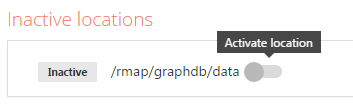
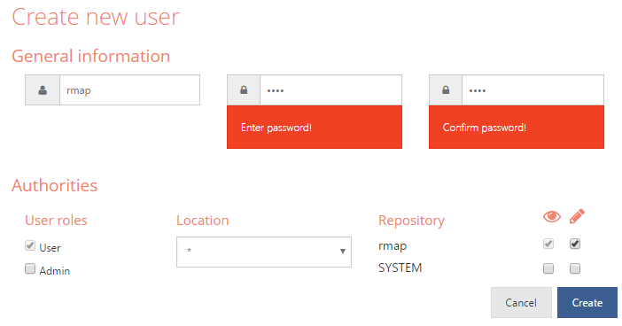
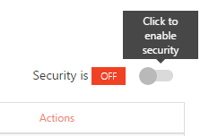
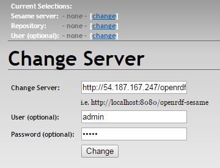
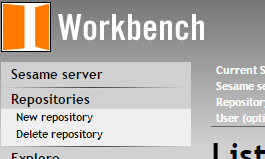
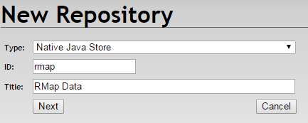

# RMap Installation (1.0.0-beta)

This document provides instructions for installing and configuring an instance of the version 1.0.0-beta release of [RMap](https://github.com/rmap-project/rmap). Suggestions for refinements and improvements to the configuration or the documentation are welcome.
-   [Introduction](#introduction)
-   [Requirements](#requirements)
-   [rmap user/group](#rmap-user-group)
-   [Install wget](#install-wget)
-   [/rmap/ folder](#rmap-folder)
-   [Java 8](#java-8)
-   [Tomcat 8](#tomcat-8)
-   [Triplestore](#triplestore)
    -   [GraphDB](#graphdb)
    -   [Sesame Native Java Triplestore](#sesame-native-java-triplestore)
-   [MySQL Server](#mysql-server)
-   [RMap web services](#rmap-web-services)
    -   [NOID ID Minter](#id-minter)
    -   [RMap API](#rmap-api)
    -   [RMap account manager and visual navigator](#rmap-account-manager-and-visual-navigator)
-   [Note about Apache Server](#note-about-apache-server)
-   [Additional configuration](#additional-configuration)
-   [Appendix A - Properties files examples](#appendix-a)

## Introduction

For convenience and simplicity, all components described will be installed or at least symlinked to the folder `/rmap/` and, where possible, run under a user called “rmap”. Local installations may vary according to local requirements or practices. None of the internal features of RMap are dependent on applying a specific path or username.

The following installation instructions are based on Red Hat Enterprise Linux OS.

## Requirements

Later versions of these tools may work but have not been tested.

-   Linux OS
-   Tomcat 8
-   Java 8
-   GraphDB 6.6.3+. Other triplestores that use the Sesame Framework API (recently renamed to [Eclipse RDF4J](http://rdf4j.org/about/)) should work. Early iterations of RMap used the Native Java Store option of Sesame, which is fine for smaller datasets (<500,000 DiSCOs)
-   MySQL 5.5. Other versions will probably work. Only basic MySQL functionality is used.
-   Apache Server (optional). Apache Server can be used for port redirects, permissions, and SSL. It is possible to replace this by configuring TCP port access through Tomcat and iptables

Server requirements will vary. One server or multiple servers can be used. As a benchmark, our hosted RMap uses 2 AWS servers and should have stable performance up to an estimated 20 million DiSCOs or between 600 million and 1 billion statements:

1.  RMap Web Services server: AWS m3.large (2 vCPU @2.5GHz, 7.5G RAM, 32 GB SSD)
    
2.  GraphDB server: AWS m4.xlarge (4 vCPU @2.4GHz, 15G RAM, 256 GB SSD)
    

## _rmap_ user/group

The rmap user runs the Tomcat instance and owns all /rmap directories. If multiple servers are used e.g. one for the RMap web services and another for the triplestore/graph database, then the steps in this section will need to be carried out on both servers.

To configure the user on a **new** server, the following steps can be used:

#### Create user and user group

First, log into an account that has sudoer privileges, and run the following commands.
```
>sudo useradd rmap
>sudo passwd rmap
[Enter password: x 2]
```
When you create the user, a group of the same name may be created automatically and the user added to that group, if not run the following:
```
>sudo groupadd rmap
>sudo useradd -G rmap rmap
```

#### Make rmap user a sudoer

For convenience so that you don’t need to continually switch from an admin user and back, you may wish to make rmap a sudoer while performing the installation.
```
>sudo vi /etc/sudoers
```
Then add this line to the end:
```
rmap ALL=(ALL) ALL
```

#### Switching to the rmap user

During installation of RMap, sudoer access will be required at certain points. If you are in the process of installing RMap, do not switch to the RMap user until specifically instructed later in the document.

Once RMap is installed, however, it will be necessary to switch to the rmap user to configure the .bashrc file and to start or stop Tomcat. If you need to switch to the rmap user, use the following command:
```
>su rmap
[Enter password]
```

## Install wget

To support direct downloads from 3rd party sites throughout the install, you may need to install wget. First check to see if you already have it installed:
```
> wget -h
-bash: wget: command not found
```

If you get a command not found error, run the following to install:
```
> sudo yum install wget -y
```
Enter `wget -h` again to ensure you now get a list of options.

## /rmap/ folder

Create the rmap directories, make the rmap user the owner, and ensure the rmap user has appropriate rights to modify that directory. The commands for this are:
```
> sudo mkdir /rmap
> sudo chown -R rmap:rmap /rmap
> sudo chmod a+rwx /rmap
```
Check that the rights have been applied:
```
> ls -l | grep rmap
drwxrwxrwx.   2 rmap rmap    6 Jul 28 15:46 rmap
```

Switch to the rmap user and create some other directories as follows:
```
> su rmap
[enter password]
> mkdir /rmap/apache
> mkdir /rmap/oracle
> cd /rmap
> ls -l
> 
drwxrwxr-x. 2 rmap rmap 6 Jul 28 15:54 apache
drwxrwxr-x. 2 rmap rmap 6 Jul 28 15:54 oracle
```

## Java 8
_Server location: /rmap/oracle_
Next we will install and configure Java 8 on the server. If multiple servers are used, Java should be installed on all instances. Described below is a standard install, using Java 8 from the Oracle downloads site.

#### Download and unzip Java
First download and unzip the Java Development Kit to the /rmap/oracle folder:
```
>cd /rmap/oracle
>wget --no-cookies --no-check-certificate --header "Cookie: gpw_e24=http%3A%2F%2Fwww.oracle.com%2F; oraclelicense=accept-securebackup-cookie" "http://download.oracle.com/otn-pub/java/jdk/8u91-b14/jdk-8u91-linux-x64.tar.gz"
>tar xzf jdk-8u91-linux-x64.tar.gz
>ls -l
drwxr-xr-x. 8 rmap rmap      4096 Apr  1 04:10 jdk1.8.0_91
-rw-rw-r--. 1 rmap rmap 181367942 May 16 12:22 jdk-8u91-linux-x64.tar.gz
```

#### Environment variables
In this section, we will set the JAVA_HOME and JAVA_OPTS environment variable in the rmap user’s .bashrc file. Before doing the following changes, ensure that the current shell user is the rmap user. If not run the “su rmap” command. First open the .bashrc file:
```
>vi ~/.bashrc
```
Ensure the file contains the following information in .bashrc:
  
```
# .bashrc 

# Source global definitions 
if [ -f /etc/bashrc ]; then 
	. /etc/bashrc 
fi 

# User specific aliases and functions 
PATH=$PATH:$HOME/bin 
export PATH 
export JAVA_HOME=/rmap/oracle/jdk1.8.0_91 
export PATH=$PATH:/rmap/oracle/jdk1.8.0_91/bin 
export JAVA_OPTS='-Xms4g -Xmx4g -Xmn2g'
```

Note that the path may vary depending on the exact Java release used. JAVA_OPTS memory allocations will need to be adjusted based on the server’s available RAM.

Use `:w` to save the changes and `:q` to exit.

At this point close the shell and reopen it, then do the following to test the environment variables have been applied:
```
>su rmap
[enter password]
>echo $JAVA_HOME
/rmap/oracle/jdk1.8.0_91
```

#### Set server’s default Java version [optional]
In some cases it might also be useful to set this newly installed version of Java as the server default. To do this, the user needs to be a sudoer:
```
>sudo update-alternatives --install "/usr/bin/java" "java" "/rmap/oracle/jdk1.8.0_91" 1
>sudo update-alternatives --config java 
There is 1 program that provides 'java'.
 Selection 		Command 
----------------------------------------------- 
*+ 1 			/rmap/oracle/jdk1.8.0_91 
Enter to keep the current selection[+], or type selection number: [Enter]
```

In the example above, only one version of Java is installed, but where there are other versions this allows you to unambiguously define the default.

## Tomcat 8
_Server location: /rmap/apache/tomcat8_
In this section we will perform a standard Tomcat 8 install and add some configuration. This should all be done as the rmap user. Note that if you there multiple web servers, this will need to be repeated on each. Installation is described below, but if needed additional installation instructions can be found here: [http://tomcat.apache.org/tomcat-8.0-doc/appdev/installation.html](http://tomcat.apache.org/tomcat-8.0-doc/appdev/installation.html)

#### Download and unzip Tomcat
First download and unzip Tomcat 8 to the /rmap/apache folder:
```
> cd /rmap/apache
> wget "http://mirrors.koehn.com/apache/tomcat/tomcat-8/v8.0.36/bin/apache-tomcat-8.0.36.tar.gz"
> tar xzf apache-tomcat-8.0.36.tar.gz
> mv apache-tomcat-8.0.36 tomcat8
> ls -l
drwxrwxr-x. 9 rmap rmap    4096 Jul 28 17:04 tomcat8
-rw-rw-r--. 1 rmap rmap 9277365 Jun  9 10:16 apache-tomcat-8.0.36.tar.gz
```
Tomcat is now installed with default settings - it will use the JAVA_HOME and JAVA_OPTS settings in the .bashrc to start up.

#### Create and configure a setenv.sh file in Tomcat [optional]
Create file /rmap/apache/tomcat8/bin/setenv.sh to give you a space to set additional Tomcat environment variables. This gets automatically run each time you start/stop the Tomcat server, so you can use it output some information about the server when you start Tomcat.
```
> cd /rmap/apache/tomcat8/bin
> vi setenv.sh
```
Add the following to output JAVA_OPTS to the screen when starting or stopping Tomcat:
```
echo "Using JAVA_OPTS:"
for arg in $JAVA_OPTS
do
echo ">> " $arg
done
echo "_______________________________________________"
echo ""

CATALINA_BASE and CATALINA_HOME can also be set here if required.
```

#### Test Tomcat Startup
At this point it may be worth verifying that things are working. Some of these tests will require remote access to the server. Enter the startup command, and then watch Tomcat start. Ensure the paths are as expected:
```
> /rmap/apache/tomcat8/bin/startup.sh

Using JAVA_OPTS:
>>  -Xms4g
>>  -Xmx4g
>>  -Xmn2g
_______________________________________________

Using CATALINA_BASE:   /rmap/apache/tomcat8
Using CATALINA_HOME:   /rmap/apache/tomcat8
Using CATALINA_TMPDIR: /rmap/apache/tomcat8/temp
Using JRE_HOME:        /rmap/oracle/jdk1.8.0_91
Using CLASSPATH:       /rmap/apache/tomcat8/bin/bootstrap.jar:/rmap/apache/tomcat8/bin/tomcat-juli.jar
Tomcat started.
```
You can also ensure the process is running using the following command, which will output the process information:
```
> ps -ef | grep catalina
rmap     31833     1  4 17:20 pts/0    00:00:05 /rmap/oracle/jdk1.8.0_91/bin/java -Djava.util.logging.config.file=/rmap/apache/tomcat8/conf/logging.properties -Djava.util.logging.manager=org.apache.juli.ClassLoaderLogManager -Xms4g -Xmx4g -Xmn2g -Djdk.tls.ephemeralDHKeySize=2048 -Djava.endorsed.dirs=/rmap/apache/tomcat8/endorsed -classpath /rmap/apache/tomcat8/bin/bootstrap.jar:/rmap/apache/tomcat8/bin/tomcat-juli.jar -Dcatalina.base=/rmap/apache/tomcat8 -Dcatalina.home=/rmap/apache/tomcat8 -Djava.io.tmpdir=/rmap/apache/tomcat8/temp org.apache.catalina.startup.Bootstrap start
rmap     31855 31717  0 17:22 pts/0    00:00:00 grep --color=auto catalina
```
Finally, if remote access is available to your server, you can load the default Tomcat page in the browser by accessing `http://[serverip]:8080`. 8080 is Tomcat’s default port.

To continue with the installation, shut down Tomcat and verify the process has ended:
```
> cd /rmap/apache/tomcat8/bin/shutdown.sh
[..shows setenv output again..]
> ps -ef | grep catalina
rmap     31855 31717  0 17:31 pts/0    00:00:00 grep --color=auto catalina
```
#### Catalina.properties

Many of the web service paths in RMap accept encoded URIs as part of the request path e.g.

[https://test.rmap-hub.org/app/resources/http%3A%2F%2Fdx.doi.org%2F10.5281%2Fzenodo.13962](https://test.rmap-hub.org/app/resources/http%3A%2F%2Fdx.doi.org%2F10.5281%2Fzenodo.13962)

By default the server will reject this path because of the http encoded “http://”. To ensure the server accepts requests of this nature, do the following:
```
> vi /rmap/apache/tomcat8/conf/catalina.properties
```

Add the following line to the end of the file so that encoded HTTP URIs can be accepted by the server:
```
org.apache.tomcat.util.buf.UDecoder.ALLOW_ENCODED_SLASH=true
```
Enter `:w` to save and `:q` to exit vi. If Tomcat is running, a restart will be required for this to be applied. Tomcat can be stopped and started using the following commands.
```
> /rmap/apache/tomcat8/bin/shutdown.sh
> /rmap/apache/tomcat8/bin/startup.sh
```
Once running, Tomcat will automatically deploy any *.war files placed in the /tomcat8/webapps folder.

#### Secure Tomcat [optional]

Depending on whether your server will be publicly accessible, it may be a good idea to apply the following security configurations for Tomcat 8.

[https://tomcat.apache.org/tomcat-8.0-doc/security-howto.html](https://tomcat.apache.org/tomcat-8.0-doc/security-howto.html)

#### Configuring server to use port :80 / :443 [optional]

Configuring the application to use port 80 will allow you to remove the port number from the URL. This will allow you to enter the URL in a browser without defining the port number, since :80 is applied by default.

iptables is a tool for firewall configuration on Linux, but it can be used to filter and re-route requests. The instructions here show how to redirect HTTP/HTTPS requests on ports 80/433 to Tomcat’s ports 8080/8443. This supports clean URL requests without the port number appended. To configure this, run the following commands:
```
> sudo /sbin/iptables -t nat -I PREROUTING -p tcp --dport 80 -j REDIRECT --to-port 8080
> sudo /sbin/iptables -t nat -I PREROUTING -p tcp --dport 443 -j REDIRECT --to-port 8443
> sudo /sbin/iptables -t nat -I OUTPUT -p tcp -o lo --dport 80 -j REDIRECT --to-ports 8080
> sudo /sbin/iptables -t nat -I OUTPUT -p tcp -o lo --dport 443 -j REDIRECT --to-ports 8443
```
Save the setting using this command, so that they will be recreated on reboot:
```
>sudo /sbin/service iptables save
```
If the save does not work, you may need to install the iptables services, then try again:
```
> sudo yum install iptables-services
> sudo /sbin/service iptables save 
```
Finally verify the settings:
```
>sudo vi /etc/sysconfig/iptables

# Generated by iptables-save v1.4.21 on Wed Aug 10 14:47:04 2016
*nat
:PREROUTING ACCEPT [6:1060]
:INPUT ACCEPT [6:1060]
:OUTPUT ACCEPT [29:1838]
:POSTROUTING ACCEPT [29:1838]
-A PREROUTING -p tcp -m tcp --dport 443 -j REDIRECT --to-ports 8443
-A PREROUTING -p tcp -m tcp --dport 80 -j REDIRECT --to-ports 8080
-A OUTPUT -o lo -p tcp -m tcp --dport 443 -j REDIRECT --to-ports 8443
-A OUTPUT -o lo -p tcp -m tcp --dport 80 -j REDIRECT --to-ports 8080
COMMIT
# Completed on Wed Aug 10 14:47:04 2016
```
At this point ports will automatically forward the ports to the Tomcat port in the URL.

## Triplestore

For smaller databases or to test out the system, Eclipse RDF4J (previously OpenRDF Sesame) has a Native Java Store that can be hosted as a web service. For larger databases, the free version of [GraphDB](http://graphdb.ontotext.com/) is a good start. The test instance of RMap currently uses GraphDB and holds 4.2million DiSCOs. Several paid versions are available if additional scaling across multiple servers is required.

The triplestore / graph database can be installed on the same server as other web services, or a separate one. In general the machine containing the triplestore uses more memory than the server holding the RMap web services. When there is heavy read and write activity, faster storage can significantly improve triplestore performance.

### GraphDB

Server location:
_Data: /rmap/graphdb/_
_Web-based admin tool: /rmap/apache/tomcat8/webapps/graphdb_

GraphDB is a graph database that implements the Sesame Framework API. There is a free version that works well, you can register to download a copy - [https://ontotext.com/products/graphdb/](https://ontotext.com/products/graphdb/). A standard and enterprise edition is available for a fee if further scaling is required.

#### Install GraphDB

> _Note: Ontotext now offers two versions of the free GraphDB - one that comes packaged as a stand-alone server, and one in which you can use the .war file on your own web server. Either version can be used. There have also been substantial changes to the installation process since these instructions were written and they will need to be adapted accordingly for the latest release. These instructions apply to GraphDB v. 6.6.4, but we have tested up to GraphDB v. 8.0.6 to confirm that it continues to be compatible with this RMap release. GraphDB installation instructions can be found [on their website](http://graphdb.ontotext.com/documentation/free/quick-start-guide.html)._  

As the admin user:Once registered, Ontotext will send a link to download the software. You can download this file to the your local machine and move the war file to the server, or follow these steps.
```
> unzip -h
```
If unzip is not installed:
```
> sudo yum install unzip
```
Set up a directory:
```
> mkdir /rmap/graphdb
> mkdir /rmap/graphdb/data
> cd /rmap/graphdb
```
Carry out the following steps as the rmap user. Note that your “zipFileName” will be unique:
```
> wget [enter path provided by Ontotext]
> ls -l
-rw-rw-r--.  1 rmap rmap 72263005 Feb 23 08:56 [zipFileName]
> unzip [zipFileName]
...
> ls -l
-rw-rw-r--.  1 rmap rmap 72263005 Feb 23 08:56 806056306
drwxr-xr-x. 15 rmap rmap     4096 Feb 23 13:45 graphdb-free-6.6.4
> cd graphdb-free-6.6.4/sesame_graphdb
> ls
graphdb-workbench-free.war
```
Make sure Tomcat is running
```
>ps -ef|grep catalina
```
This should output two processes (described in the Test Tomcat section). If not, start up Tomcat:
```
> /rmap/apache/tomcat8/bin/startup.sh
```
Then do the following (you should still be at the path /rmap/graphdb/graphdb-free-6.6.4:
```
> mv graphdb-workbench-free.war /rmap/apache/tomcat8/webapps/graphdb.war
```
If Tomcat is running, within a few seconds a new graphdb folder will have automatically deployed:
```
> ls /rmap/apache/tomcat8/webappsdocs examples graphdb graphdb.war host-manager manager ROOT
```
Confirm that GraphDB is running by accessing the GUI through a web browser:

http://[servername]:8080/graphdb

The next steps require that you can access GraphDB through a browser.

#### Create and configure first GraphDB repository

By default there is no login for the admin tool, and data will be stored in your /home/rmap directory. To configure this take the following steps:

1.  To start, load the newly installed GraphDB administrative tool: http://[servername]:8080/graphdb
2.  Go to the Admin menu and select “Locations and Repositories”
3.  Click the “Attach Location” button, bottom-right.
4.  Enter the file path “/rmap/graphdb/data” and click Add. This will be added as an “Inactive location”.
5.  Use the slider to the right of the new path to activate the location. You will see the path at the top of the page be replaced with this new path.
      
6.  You will now see the original /home/rmap/ path in the inactive location. This can be removed by clicking the “x” to the right of it.
7.  Click the “Create repository” button. The settings here may vary depending on you server specification and database size. For now, change the following settings, the rest can stay at their default value. You can tweak these later as needed. Note that the GraphDB developers offered the following rule of thumb:
    
    _On an average dataset the "Total cache memory" value should be between 10-15% of the GraphDB's storage folder._
    
    This configuration assumes you have at least around 4GB of RAM available to the JVM.
	 | Property Name | Value |
	 |--|--|
	 | RepositoryID | rmap |
     | Repository title | RMap data |
	 |   Rule-set | No inference |
	 | Base URL | [blank]| 
	 | Entity index size | 10000000 (can’t change this) |
     | Total cache memory | 3500M |
     | Tuple index memory | 3000M |
     | Use predicate indices | [checked] |
     | Predicate index memory | 500M |
     | Use context index | [checked] |
     | Throw exception on query time-out | [checked] |    
8.  Click the Create button. The new repository will now be listed on the Locations and Repositories page.

The GraphDB site includes clear instructions for configuring the server and the team are very helpful if you have any questions. [http://graphdb.ontotext.com/documentation/6.6/free/toc.html](http://graphdb.ontotext.com/documentation/6.6/free/toc.html)

#### Create and configure GraphDB user
By default the GraphDB GUI allows public access to all databases. To configure the database accounts, take the following steps:
1.  Go to the Admin menu and click “Users and Access”. You will see a single user account for “admin”. The default password is “root”. Change this by clicking the “Edit User” icon to the right of the account name. Enter a new password and press save.
2.  Back in the Users and Access screen, click the “Create new user” button.
3.  Enter user name “rmap” and a password, then assign read and write access to the new rmap database. The screen should look like this:
    
4.  Click the “Create” button. The new account will appear in the Users and Access window.
5.  Enable security by clicking the button in the top left of the Users and Access window:
    
6. .  When you click this, GraphDB will log you out and you will need to log back in. This gives you the opportunity to test your new account login.

### Sesame Native Java Triplestore

Note: This is an alternative to GraphDB. If you have installed GraphDB - this section can be skipped

Server location:
_Data: /rmap/sesame/_
_Web-based admin tool: /rmap/apache/tomcat8/webapps/openrdf-workbench_
_Web-based API path: /rmap/apache/tomcat8/webapps/openrdf-sesame_

GraphDB has proven to be much more stable in our tests and is easier to administer, but if you prefer to avoid the registration process, we experienced few problems using this option up to around 500,000 DiSCOs. _Note that OpenRDF has recently morphed into this: [http://rdf4j.org/](http://rdf4j.org/), RDF4J 2.2 has been used with RMap and works fine, but these instructions have not been updated to reflect the new version_. Here is the version tested with RMap 1.0.0-beta:

[https://sourceforge.net/projects/sesame/files/Sesame%204/4.1.1/](https://sourceforge.net/projects/sesame/files/Sesame%204/4.1.1/)  

#### Configure database storage folder
Before installing Sesame, it is best to set the base directory for the data. The “basedir” property in JAVA_OPTS overrides the default storage path for the triplestore.

To set this, first ensure you are logged in as the rmap user, then create the directory for the data:
```
> mkdir /rmap/sesame
> mkdir /rmap/sesame/data
```
Next edit the .bashrc file, as described in the Java 8 configuration section (vi ~/.bashrc). Modify the line that sets the JAVA_OPTS variable to now include the base directory property for Sesame as follows:
```
export JAVA_OPTS='-Dinfo.aduna.platform.appdata.basedir=/rmap/sesame/data/ -Xms4g -Xmx4g -Xmn2g'
```
#### Configure database storage folder
To complete the installation, continue to perform these steps as the rmap user:
```
> cd /rmap/sesame
> wget https://sourceforge.net/projects/sesame/files/Sesame%204/4.1.1/openrdf-sesame-4.1.1-sdk.tar.gz/download
...
> tar xvfz download
...
> ls -l
-rw-rw-r--. 1 rmap rmap 65111374 Mar  6 21:41 download
drwxrwxr-x. 6 rmap rmap       82 Aug  3 17:08 openrdf-sesame-4.1.1
> cd openrdf-sesame-4.1.1/war
> ls
openrdf-sesame.war  openrdf-workbench.war
```
Make sure Tomcat is running
```
> ps -ef|grep catalina
```
This should output two processes (described in the Test Tomcat section). If not, start up Tomcat:
```
> /rmap/apache/tomcat8/bin/startup.sh
```
Then do the following:
```
> mv *.war /rmap/apache/tomcat8/webapps/
```
If Tomcat is running, within a few seconds a new openrdf-sesame and openrdf-workbench folder will have automatically deployed in webapps:
```
> ls /rmap/apache/tomcat8/webapps
docs      host-manager  openrdf-sesame      openrdf-workbench      ROOT
examples  manager       openrdf-sesame.war  openrdf-workbench.war
```
You can verify this is running by accessing http://[yourserveraddress]:8080/openrdf-sesame. You should see a “Welcome” screen.

#### Configure Sesame users

The Sesame database utilizes Tomcat users to restrict access. Here is the current user config, which can be adapted per requirements. More information can be found [here](http://www.rivuli-development.com/further-reading/sesame-cookbook/basic-security-with-http-authentication/) (note: you have to view source to see the embedded code!):

Add the following users to the <tomcat-users> tag in /rmap/apache/tomcat8/conf/tomcat-users.xml file
```
    <user username="rmap" password="*****" roles="rmap-editor"/>
    <user username="guest" password="*****" roles="rmap-viewer"/>
    <user username="admin" password="*****" roles="rmap-editor,sesame-admin"/>
```
Next add the following sections to /rmap/apache/tomcat8/webapps/openrdf-sesame/WEB-INF/web.xml within the <web-app> tags.

(full file not shown, just parts for user config)
```
<security-constraint>
	<web-resource-collection>
		<web-resource-name>Sesame repository viewer access</web-resource-name>
		<url-pattern>/repositories/rmap</url-pattern>
		<http-method>GET</http-method>
		<http-method>POST</http-method>
	</web-resource-collection>
	<auth-constraint>
		<role-name>rmap-viewer</role-name>
		<role-name>rmap-editor</role-name>
	</auth-constraint>
</security-constraint>

<security-constraint>
	<web-resource-collection>
		<web-resource-name>Sesame test repository viewer access</web-resource-name>
		<url-pattern>/repositories/rmap/*</url-pattern>
		<http-method>GET</http-method>
	</web-resource-collection>
	<auth-constraint>
		<role-name>rmap-viewer</role-name>
		<role-name>rmap-editor</role-name>
	</auth-constraint>
</security-constraint>

<security-constraint>
	<web-resource-collection>
		<web-resource-name>Sesame rmap repository: editor write access</web-resource-name>
		<url-pattern>/repositories/rmap/*</url-pattern>
		<url-pattern>/repositories/rmap/</url-pattern>
		<http-method>POST</http-method>
		<http-method>PUT</http-method>
		<http-method>DELETE</http-method>
	</web-resource-collection>
	<auth-constraint>
		<role-name>rmap-editor</role-name>
	</auth-constraint>
</security-constraint>
<security-constraint>
	<web-resource-collection>
		<web-resource-name>Sesame System Config Restricted access</web-resource-name>
		<url-pattern>/repositories/*</url-pattern>
		<url-pattern>/repositories/</url-pattern>
		<http-method>GET</http-method>
		<http-method>POST</http-method>
		<http-method>PUT</http-method>
		<http-method>DELETE</http-method>
	</web-resource-collection>
	<auth-constraint>
		<role-name>sesame-admin</role-name>
	</auth-constraint>
</security-constraint>
<login-config>
	<auth-method>BASIC</auth-method>
	<realm-name>Sesame</realm-name>
</login-config>

<security-role>
	<description>The role that is required to access the Sesame server configuration</description>
	<role-name>sesame-admin</role-name>
</security-role>

<security-role>
	<description>The role that is required for read access to the rmap repository</description>
	<role-name>rmap-viewer</role-name>
</security-role>

<security-role>
	<description>The role that is required for write access to the rmap repository</description>
	<role-name>rmap-editor</role-name>
</security-role>
```

#### Create Sesame triplestore

Since the settings have been changed, you will need to close and re-open your terminal. Then do the following:
```
> su rmap
Password: [enter password]
> echo $JAVA_OPTS
-Dinfo.aduna.platform.appdata.basedir=/rmap/sesame/data/ -Xms4g -Xmx4g -Xmn2g
> /rmap/apache/tomcat8/bin/shutdown.sh
...
> /rmap/apache/tomcat8/bin/startup.sh
```
Once Tomcat has started back up, visit http://[yourservername]:8080/openrdf-workbench. The first time you access this, it make take a few minutes to load the page. To create your repository, take the following steps:

1.  Log in as the administrator using the login box:
    
    The server path should be the path you loaded earlier to see the welcome page - http://[yourServerName]:8080/openrdf-sesame and the user name and password will be the ones you set in the configuration file earlier. Once again there will be a lag the first time you log in.
        
    
2.  Next click the link on the left for “New repository”.
       
     Fill in the form and click Next:  
        
3.  The next page will give you the option to add indexes. Enter the following:
    ```
    spoc,posc,cspo
    ```
    then click “Create”. You now have a new triplestore.
    
## MySQL Server

MySQL Server is currently being used for the user database. There are numerous methods for installing MySQL, and it may be best to use the [MySQL website](https://www.mysql.com/) to find the one best suited to your environment. In institutions that use other MySQL databases, it may be easiest to create an RMap database on the existing databsae server and just configure the MySQL users and connection properties in the RMap web service. With that said, here is one method for installing MySQL on the same server as everything else.
```
> sudo yum install mysql-community-server
```
If the yum install does not run, you may need to add the mysql yum repository to your server. This link has instructions: [http://dev.mysql.com/doc/mysql-yum-repo-quick-guide/en/](http://dev.mysql.com/doc/mysql-yum-repo-quick-guide/en/) Once the install has been run, do the following to start the service:
```
> sudo service mysqld start
Starting mysqld:[ OK ]
```
For MySQL 5.7, a temporary password will be generated and placed in the MySQL log file. You will need this to log in. Run the following command to retrieve the temporary password:
```
> sudo grep 'temporary password' /var/log/mysqld.log2016-08-05T14:43:49.105865Z 1 [Note] A temporary password is generated for root@localhost: 8ZgPd=q1gxk_
```
Next, secure the installation:
```
> sudo /usr/bin/mysql_secure_installation
Securing the MySQL server deployment.
Enter password for user root: [enter temporary root pwd]
The existing password for the user account root has expired. Please set a new password.
New password: [enter new password - only secure passwords will work]
[respond to prompts]
```
Login and create the initial database and users. Note that you may wish to add access rights for another IP that will be used to administer the database remotely, is so the second GRANT command can do this:
```
> mysql -u root -p 
> password: <rmap>

#logged into rmap
mysql> CREATE DATABASE rmap;
mysql> GRANT ALL PRIVILEGES ON rmap.* TO 'rmap'@'localhost' IDENTIFIED BY ‘[password]';
mysql> GRANT ALL PRIVILEGES ON rmap.* TO 'rmap'@'[anotherIpThatRequiresAccess]' IDENTIFIED BY ‘[password]’;
```
Finally, you will need to create the database tables. First make sure you are using the new database:

mysql> use rmap
Database changed

Next copy and paste the table creation scripts, which can be found here:

[https://github.com/rmap-project/rmap/releases/download/v1.0.0-beta/createTables.sql](https://github.com/rmap-project/rmap/releases/download/v1.0.0-beta/createTables.sql)

Verify that the tables were created successfully:
```
mysql> show tables;
+-----------------------+
| Tables_in_rmap        |
+-----------------------+
| ApiKeys               |
| UserIdentityProviders |
| Users                 |
+-----------------------+
3 rows in set (0.00 sec)
mysql> quit
Bye
```

## RMap web services

Each RMap web application is available as a Java web archive (.war) file. There are two main applications for RMap:
*   RMap API
*   RMap account manager and visual navigator
    
Though the applications are installed as separate services, both are required in order to use RMap. The web-based account manager tool allows the user to log in using Google, Twitter, or ORCID then manage API keys that can be used to access the RMap API.

Before either service will work, both services will need to be able to access to a web service that can mint unique IDs. Instructions to configure a NOID minter for these service are provided here.

#### ID Minter

RMap includes a generic ID minting function that can be configured to work with an HTTP web service. The service supports basic authentication, some simple validation and customization of a prefix. If you do not have access to such a service, for convenience, below are instructions for setting up a local NOID minter that can be used to mint RMap IDs. It can also be configured to mint ARK IDs if your institution has an ARK NAAN assigned. By default, this service will mint IDs in the format of e.g. rmap:akd2kjw6f. The service does not include authentication features, so you will need to limit access the service either by configuring Tomcat to include a remote access filter, or if using Apache Server over Tomcat, that could be configured to restrict access.

Start by setting up a directory for the NOID installation:
```
> mkdir /rmap/noid
> cd /rmap/noid
```
Next, install Perl / CPAN and the various Perl module pre-requisites. _Note: if the Fcntl install fails, it may already be installed and this step can be skipped_
```
> sudo yum install perl-CPAN
> sudo cpan YAML
> sudo cpan Getopt::Long
> sudo cpan ExtUtils::MakeMaker
> sudo cpan Text::ParseWords
> sudo cpan Fcntl 
```
Install Berkeley DB, which will keep track of the IDs already used:
```
> sudo yum install perl-BerkeleyDB
```
Install the NOID minter:
```
> sudo wget http://search.cpan.org/CPAN/authors/id/J/JA/JAK/Noid-0.424.tar.gz
> sudo chown rmap:rmap *
> tar xf Noid-0.424.tar.gz
> mv Noid-0.424 noidminter
```
Edit the noid file and remove the "T" in -Tw from first line of noidminter/noid
```
> vi noidminter/noid
#!/usr/bin/perl -w -Ilib -I../lib
```
Copy the NOID perl library to the perl5 folder
```
> sudo cp lib/Noid.pm /usr/local/share/perl5/
```
Set up the noid minter database
```
> cd /rmap/noid
> mkdir noiddb
> perl noidminter/noid dbcreate .reeeeeeeeek
> mv NOID noiddb/
```
Test the minter is working
```
> perl noidminter/noid -f /rmap/noid/noiddb mint 1
id: j0zpc868tv
```
Install the web service for minting noids by doing the following:
```
> cd /rmap/noid
> wget https://github.com/rmap-project/rmap/releases/download/v1.0.0-beta/noid.war
> cp noid.war /rmap/apache/tomcat8/webapps/
> wget https://github.com/rmap-project/rmap/releases/download/v1.0.0-beta/noid.sh
```
Edit the noid.sh and make sure the paths are pointing to the correct directories. The first path should point to the minter script, the second to the noid database folder. Also, replace the code after the "mint" command with the argument `$1` so that your file is similar to the one below.
```
> vi /rmap/noid/noid.sh
#!/bin/ksh
echo "Content Type: text/html\n"
/rmap/noid/noidminter/noid -f /rmap/noid/noiddb mint $1
```
Add environment variables to define the path for the noid script. The web service will use this to mint IDs.
```
>vi ~/.bashrc
```
Add the following lines to the file (note the Perl paths may vary depending on your operating system).
```
export NOID_SCRIPTS_HOME=/rmap/noid
export PERL5LIB=/usr/local/share/perl5:/usr/share/perl5:/usr/lib64/perl5
```
Log out of shell and back in to set the environment variables, then test the service:
```
> su rmap 
> wget http://localhost:8080/noid/noid.sh?1
id: kjfk2jf6kjas
```
If you configure the NOID minter in this way, the default settings in the rmapcore.properties should work for API and Web application. An example is shown in Appendix A.

Note that during performance testing, the NOID minter was found to be a bottleneck since repeated round trips to the minter were required for every ID. The minter described here supports a request for multiple IDs at once. These are held in memory until used. For high volume use it may be worth requesting batches of e.g. 100 IDs at once to improve performance.

### RMap API

The RMap API supports management of DiSCOs and navigation of RDF data through various API paths. The various API paths and available parameters are fully documented on the RMap wiki. Read only access is available without an API key. To manage DiSCOs, the user must create an account through the RMap account manager application.

The RMap API can be deployed by dropping the .war file into the webapps folder of a running tomcat (/rmap/apache/tomcat8/webapps). Here are the step by step instructions for installation to be completed as the rmap user:
```
> mkdir /rmap/rmap
> cd /rmap/rmap
> wget https://github.com/rmap-project/rmap/releases/download/v1.0.0-beta/rmap-api-1.0.0-beta.war
> ls
rmap-webapp-1.0.0-beta.war
> mv rmap-api-1.0.0-beta.war /rmap/apache/tomcat8/webapps/api.war
> ls /rmap/apache/tomcat8/webapps 
api      docs      graphdb      host-manager      ROOT
api.war  examples  graphdb.war  manager
```
Before accessing the API, you will need to modify the configuration files. To do this:
```
> cd /rmap/apache/tomcat8/webapps/api/WEB-INF/classes
> vi rmapapi.properties
```
Follow the instructions in the properties file to define your application properties. Do the same for the files rmapauth.properties, and rmapcore.properties. [Appendix A](#appendix-a has examples of how your properties files might look after being configured. Once you have configured all 3 properties files, backup the settings for future reference and restart Tomcat  
```
> cp *.properties /rmap/rmap/
> /rmap/apache/tomcat8/bin/shutdown.sh
> /rmap/apache/tomcat8/bin/startup.sh
```
It may take a few minutes for the application to start up for the first time. Once the service has started you should be able to see a message through the following URL:

http://[yourdomainname]:8080/api/discos

### RMap account manager and visual navigator

Installation of this service is similar to the API. In this instance we will deploy the webapp as the /app/ directory, but you can deploy it under any name provided you update the properties as needed.
```
> cd /rmap/rmap 
> wget https://github.com/rmap-project/rmap/releases/download/v1.0.0-beta/rmap-webapp-1.0.0-beta.war
> ls
rmap-webapp-1.0.0-beta.war
> cd /rmap/apache/tomcat8/webapps
> mv /rmap/rmap-webapp-1.0.0-beta.war /rmap/apache/tomcat8/webapps/app.war
> ls 
api      graphdb      app
api.war  graphdb.war  app.war
```
As with the API web service, before accessing the website, you will need to modify the configuration files. To do this:
```
> cd /rmap/apache/tomcat8/webapps/app/WEB-INF/classes
> vi rmapweb.properties
```
Follow the instructions in the properties file to define your application properties. Note that you will need to visit each of 3 OAuth providers (Twitter, ORCID, and Google) and sign up for the OAuth Key/Secret.

Next, configure the properties in rmapauth.properties, and rmapcore.properties. As a shortcut you can just copy these from /rmap/rmap) as follows:
```
> rm rmapauth.properties 
> cp /rmap/rmap/rmapauth.properties rmapauth.properties
> rm rmapcore.properties
> cp /rmap/rmap/rmapcore.properties rmapcore.properties
```
[Appendix A](#appendix-a) has examples of how your properties files might look after being configured.

In addition to the 3 main properties files, there are 3 others in the classes folder. Each of these additional properties files are used to generate the RMap visualizations and contain some default values. These may be appropriate for initial use, but you may choose to update these over time:

* _ontologyprefixes.properties_ - Allows you to define display prefixes for specific ontology paths e.g. [http://purl.org/dc/elements/1.1/](http://purl.org/dc/elements/1.1/) can be replaced with “dc:”. Any unidentified ontology paths will display as “x:”

* _nodetypes.properties_ _-_ Allows you to configure the node types that are distinguishable in the visualization and what these will look like (color and shape).

* _typemappings.properties_ _-_ Allows you to configure which rdf:type URIs map to the various node types defined.

Once you have configured all properties files, backup the properties files for future reference. Finally, restart Tomcat so that the new settings are applied:
```
#CAUTION:this will overwrite existing files with same name

> mkdir /rmap/rmap/webprops
> cp *.properties /rmap/rmap/webprops/ 

> /rmap/apache/tomcat8/bin/shutdown.sh
> /rmap/apache/tomcat8/bin/startup.sh
```
You should now be able to see the webapp at http://[yourservername]:8080/app.

You now have a basic working copy of the RMap system.

## Note about Apache Server

Some institutions prefer to put an Apache Server instance over Tomcat for a variety of reasons. Typically the Apache Server runs on port 80 and forwards requests for Tomcat webservices to port 8080. Port 8080 can then be closed for public access. If this is the case in your environment, there are certain properties that need to be set in Apache Server’s httpd.conf file. Below is an example of the virtual host configuration for an RMap instance with SSL applied. Note the ProxyPreserveHost and AllowEncodeSlashes settings - these are vital for RMap to function correctly:  
```
ProxyPreserveHost Off
AllowEncodedSlashes NoDecode
ProxyPass / http://localhost:8080 nocanon
ProxyPassReverse / http://localhost:8080 nocanon
```

## Additional configuration

If all of the instructions were followed successfully, you should have a working copy of RMap. Further configuration in a production environment may vary widely according institutional standards. Work with a server configuration specialist to determine the best approaches to securing the server using SSL and constraining port access through a firewall.

## Appendix A 
### Properties files examples
The following are examples of how your properties files might look if you followed the instructions in this document. Note that comments have been removed for brevity.

#### rmapapi.properties
```
rmapapi.path=https\://123.45.67.89:8080/api
rmapapi.documentationPath=https\://rmap-project.atlassian.net/wiki/display/RMAPPS/API+Documentation
```

#### rmapauth.properties
```
rmapauth.baseUrl=http\://123.45.67.89:8080/app
authdb.driverClassName=com.mysql.jdbc.Driver
authdb.url=jdbc:mysql://123.45.67.89:3306/rmap?autoReconnect=true
authdb.username=rmap
authdb.password=rmappwd
```

#### rmapcore.properties
```
rmapcore.defaultQueryLimit=200
rmapcore.maxQueryLimit=2000
rmapcore.defaultStatusFilter=active
rmapcore.defaultOrderBy=UNORDERED
sesamehttp.url=http\://123.45.67.89:8080/graphdb/
sesamehttp.repositoryName=rmap
sesamehttp.user=rmap
sesamehttp.password=rmappwd
sesamesail.dataDirectory=
idservice.idMinterUrl=http\://localhost:8080/noid/noid.sh?2
idservice.idPrefix=rmap:
idservice.maxRetries=2
idservice.replaceString=id:
idService.userName=
idservice.userPassword=
idservice.idLength=15
idservice.idRegex=rmap:[a-z0-9]{10}
```

#### rmapweb.properties
```
rmapweb.google-key=203948903284-adsf900auif09adif0kjasd0f9i.apps.googleusercontent.com
rmapweb.google-secret=JKel-LDkd983nfdkaa23
rmapweb.google-callback=https\://123.45.67.89:8080/user/googlecallback
rmapweb.orcid-key=APP-20IDJF0O3KD2PO3KJ4
rmapweb.orcid-secret=9djk3k3-kd39dk-902k-ds92-qn29dw1d02mkd
rmapweb.orcid-callback=https\://123.45.67.89:8080/user/orcidcallback
rmapweb.twitter-key=0923jAUa02dln92jmaoFdk9j
rmapweb.twitter-secret=jaMPe134ld7HrwB9lsN92rpm982NMm029jdkjJ9alwe5
rmapweb.twitter-callback=https\://123.45.67.89:8080/user/twittercallback
```