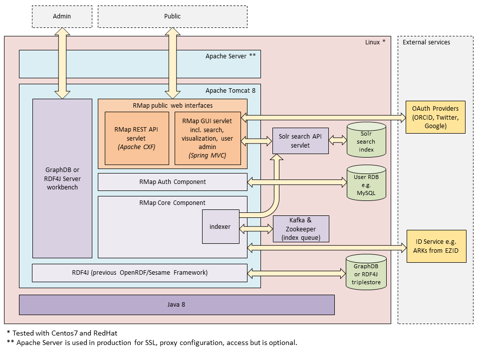

## Software Stack

* [Purpose of the document](#purpose-of-the-document)
* [Software Stack Diagram](#software-Stack-diagram)
* [Software Stack Components](#software-stack-components)
	* [Linux](#linux)
	* [Apache Server](#apache-server)
	* [Apache Tomcat](#apache-tomcat)
	* [Java 8](#java-8)
	* [RMap public web interfaces](#rmap-public-web-interfaces)
		*  [REST API](#rest-api)
		* [GUI](#gui)
	* [RMap Auth component](#rmap-auth-component)
	* [RMap Core component](#rmap-core-component)
	* [Solr Search API & index](#solr-search-api--index)
	* [Kafka & Zookeeper](#kafka--zookeeper)
	* [Triplestore](#triplestore---graphdb-or-rdf4j-server)
	* [Relational database](#relational-database-currently-mysql-or-mariadb)
	* [RDF4J](#rdf4j)
	* [ID service](#id-service)
	* [OAuth 2.0 Providers](#oauth-20-providers)


## Purpose of the document

This document represents the software stack of RMap as a block diagram. It then briefly describes each component and cites the version of the software currently used and/or tested.

## Software Stack Diagram

Below is the latest representation of the software stack used in [RMap release version 2.0.0-beta](https://github.com/rmap-project/rmap/releases/tag/v2.0.0-beta).
 


Previous versions:
  * [Software Stack Block Diagram 1.0.0-beta](software-stack-block-diagram-1-0-0-beta.png)

## Software Stack Components

### Linux

Operating system that production RMap components run on. RMap has been tested with RedHat and CentOS7 but is probably workable with other Linux flavors.

### Apache Server

_Version(s) tested/running: Apache/2.2.31 but don’t expect issues with other versions with equivalent configuration_

_Default port(s): 80, 443_

Used as a reverse proxy for Tomcat, adds some convenience for configuring redirects, SSL certificates, CORS access etc. **Allowing encoded slashes is crucial for proper functioning of RMap** since many URLs contain encoded slashes. Here is an example of how to configure this:
```
<VirtualHost *:443>
# ssl and other configuration goes here
...
# important properties for RMap to function 
AllowEncodedSlashes NoDecode
ProxyPreserveHost Off

ProxyPass /api http://localhost:8080/api nocanon
ProxyPassReverse /api http://localhost:8080/api nocanon
ProxyPass /app http://localhost:8080/ nocanon
ProxyPassReverse /app http://localhost:8080/ nocanon

</VirtualHost>
```

### Apache Tomcat

_Version(s) tested/running: Tomcat 8.0.X. Version updates should be done with caution. There are documented issues with upgrading to 8.5.X. See [this issue in GitHub](https://github.com/rmap-project/rmap/issues/74)._

_Default port(s): 8080, 8443_

Serves the RMap API and GUI. Runs on port 8080/8443, with Apache Server forwarding 80/443 requests. Depending on the configuration, Tomcat may also serve Solr and GraphDB, but the versions of these that are currently used in production have their own internal web server.

#### catalina.properties
Where Apache Server is used, little configuration is needed for Tomcat beyond the default. Specifically, you will need to configure the Java heap limits as normal. Several lines of configuration should also be added to the `tomcat/conf/catalina.properties` file. 

Allowing encoded slashes is vital for RMap to function, as with the Apache Server. 
```
org.apache.tomcat.util.buf.UDecoder.ALLOW_ENCODED_SLASH=true
```
 
Adding the `rmap.configFile` property to `catalina.properties` allows you to override the default values in the various properties files. By default these properties files are embedded in the deployed webapps (e.g. `tomcat/webapps/api/WEB-INF/classes`) and are therefore vulnerable to accidental overwrites. 
```
rmap.configFile=file:///rmap/properties/rmap.properties
```
An example annotated `rmap.properites` file can be found in the relevant [GitHub release](https://github.com/rmap-project/rmap/releases).

The `spring.profiles.active property` allows you to override some of the default RMap component configuration if needed. More about the Spring options and defaults are documented in [DEVELOPER.md in the RMap codebase](https://github.com/rmap-project/rmap/blob/master/DEVELOPER.md).
```
spring.profiles.active=default,persistent-db,ark-idservice,http-triplestore,http-solr,prod-kafka,auto-start-indexing
```


### Java 8
*Version(s) tested/running: OpenJDK version 1.8.0_151 is currently on the development server, but I don’t anticipate problems with running other flavors of Java 8.*

Most components require Java to run. Specifically Tomcat, the RMap components (which are run on Tomcat), GraphDB, Kafka, Zookeeper, Solr.  Because so many of the pieces run using Java, if multiple components are sharing a machine, the Java heap allocations need to be thought out carefully. 

### RMap public web interfaces
*Version(s) tested/running: 2.0.0-beta is current production version*
The web components are deployed as Java web archive (.war) files, which are generated in the /api and /webapp sub-projects during the RMap code build.

#### REST API
The REST API is public for readonly access. DiSCOs can be created by users who sign up for and use an API key. The REST API uses the auth component to check key validity, and the Core component to manage and interact with the RDF graphs. Full documentation for how to use the API and what you can find there is on the [RMap technical documentation](https://github.com/rmap/rmap-documentation).

#### GUI
The public RMap GUI supports 2 functions:
1.  Search the RMap data using Solr and then navigate visually through the RDF data that was created via the API. The RMap Core component is used to interact with the RDF data. The visualizations are created using [vis.js](http://visjs.org/docs/network/).
2.  It supports creation and management of users and keys via one of 2 paths - one or both can be enabled.
    *  a user can sign themselves up by logging in using Twitter, Google, or ORCID. Once logged in they can configure their RMap Agent and generate API keys that can be used to create DiSCOs via the REST API.
    *  an administrator can use the /admin interface to log in and manage all users and their keys. This is an option if an implementer wants to disable oauth login and instead manage key access centrally. It is also useful for generating keys for specific purposes under an account that is not necessarily connected to an individual identity, for example you might make a key under a JHU account for a PASS loader. The admin tool also supports hard delete of DiSCOs. This is not available through the API. It was added here for special requests, for example, if someone has accidentally submits sensitive information to RMap and a soft delete through the API will not suffice.

The RMap Auth component is used to interact with the user database for management of users and keys.

### RMap Auth component
*Version(s) tested/running: 2.0.0-beta is the current production version*

This is used by the REST API and GUI to support User management. Primarily it interacts with a relational database to manage the user and key data, and determine whether keys used through the API are authorized to create data in RMap.

### RMap Core component
*Version(s) tested/running: 2.0.0-beta is the current production version*

The core contains the model and all code to interact with the RMap DiSCO, Agent, and Event data in the triplestore. Both the API and the GUI use the core component for these interactions.

Within the core component, there is an indexer component that interacts with Kafka to manage the queue of new and updated objects waiting to be indexed. The indexer component takes items waiting in the queue and pushes them into the Solr index.

The core component does not deal with any auth code. It is assumed that anything interacting with the core component has already been authorized to make changes to the triplestore. The only thing it will do in this vein is prevent RMap Agents making changes to DiSCOs that they did not create.

### Solr Search API & index
*Version(s) tested/running: Solr 7.7 is installed in production and 6.6.2 is used for integration tests so either will work. Solr 8 is not compatible at this time.*

*Default port(s): 8983*

The Solr piece was added as part of the updates for 2.0.0-beta, it was not part of the initial 1.0.0-beta release. Other versions of Solr have not yet been tested.

The Solr Search API supports the text search interface on the GUI. The RMap core component uses Kafka to ensure all changes to the data make it into the index so that they can are discoverable through the UI.

To run this component, you need to copy the ['cores' directory hierarchy](https://github.com/rmap-project/rmap/tree/master/indexing-solr-resources/src/main/resources/cores) (including the cores directory itself) somewhere underneath the SOLR_HOME directory on your Solr instance. Solr will discover the core by the presence of the core.properties file. The startup log should indicate the discovered core, name discos. 

### Kafka & Zookeeper
*Version(s) tested/running: Zookeeper 3.4.10 is being run along with Kafka 1.0.0*

*Default port(s): 9092*

Kafka manages the stream of new and updated RMap objects that are waiting to be added or updated in the Solr index. Kafka requires Zookeeper to manage the Kafka cluster and so you can’t have Kafka without Zookeeper.

### Triplestore - GraphDB or RDF4J server

*Version(s) tested/running: GraphDB 8.0.6 (free distribution) for production. I suspect other versions of GraphDB would be fine too - check the documentation for compatibility issues. The free distribution restricts concurrent users, but has so far been OK for the level of use we have. Subscriptions are available for higher volume use. RDF4J server 2.2.2 is used for integration tests and may be sufficient for small production environments.*

*Default port(s): 7200*

The triplestore stores the RMap objects (Agents, Events, DiSCOs) as RDF. RDF4J is a triplestore. GraphDB, while also officially a triplestore has some graph database type features and a more sophisticated workbench tool than RDF4J server. The version of GraphDB used does not run on Tomcat, but has its own internal web server, similar to Solr.

### Relational database (currently MySQL or MariaDB)
*Verson(s) tested/running: MySql 5.5.2 and MariaDB 2.0.3. I suspect that most relational databases will work with this since the database use is quite basic.*

*Default port(s): 3306*

Stores User data and associated API keys where created. Before use of a new database, the [createTables.sql](https://github.com/rmap-project/rmap/blob/master/auth/createTables.sql) script needs to be run on the empty database. This may need to be adapted if other RDB platforms are used.

Regardless of which database is used, it’s important to specify the appropriate driver is referenced in the `rmap.properties` file, and that the jar file for the driver is downloaded and copied to the `tomcat/lib` folder.

### RDF4J
*Version(s) tested/running: RDF4J 2.2.2. So far attempting to upgrade past this version has caused a variety of issues. There is an open issue for this [https://github.com/rmap-project/rmap/issues/221](https://github.com/rmap-project/rmap/issues/221).*

RDF4J is an Eclipse project - it is an open source Java framework for managing RDF4J data. RMap’s core module depends on this framework to interact with the triplestore. It superseded the previous iteration of the project called “Sesame”

### ID service
*Version(s) tested/running: N/A*

The ID service is responsible for providing unique minted IDs that can be assigned to new DiSCOs, Events, Agents and blank nodes within DiSCOs. RMap supports using a local ARK ID minter or it can integrate with the EZID ARK minting API service. The EZID service supports minting a backlog of IDs in order to speed up DiSCO creation for a limited amount of DiSCOs that are created in quick succession.

### OAuth 2.0 Providers
*Version(s) tested/running: N/A*

RMap GUI allows users to login using their Twitter, Google, or ORCID accounts. This requires OAuth 2.0 callouts to those 3rd party OAuth providers when people log in.
